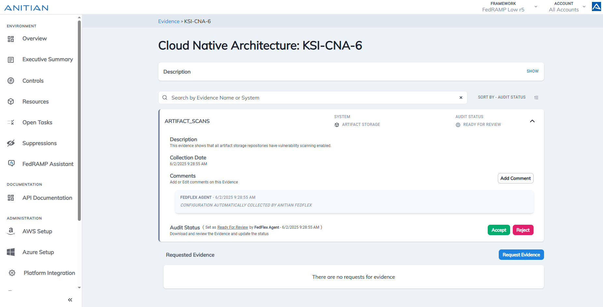
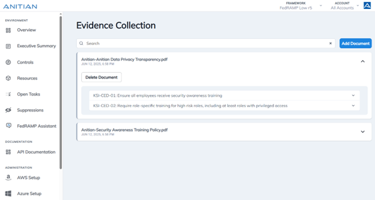
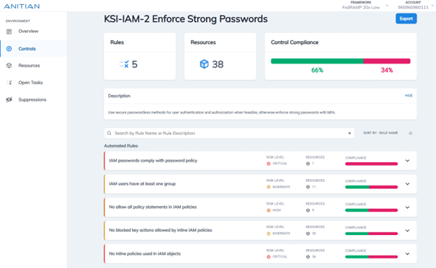

   

Anitian is excited to participate in the FedRAMP 20x pilot. We applaud the iterative, transparent, and collaborative approach of the PMO and look forward to working together to deliver innovative solutions for the U.S. government.  

This is a pre-audit submission as we continue to engage with A-LIGN, our 3PAO partner, to ensure we deliver a model that is repeatable for all CSPs seeking FedRAMP low authorization.  

## Anitian FedFlex Starter 
Anitian’s FedFlex Starter is an AI-powered compliance automation platform purpose-built to help SaaS companies achieve FedRAMP 20x authorization faster, with more flexibility, and with greater confidence.  

With a track record of helping SaaS providers achieve a FedRAMP Marketplace listing, Anitian combines pre-engineered security infrastructure, agentic AI, and expert advisory services to accelerate time-to-compliance without compromising on rigor.  

FedFlex Starter includes:  
- Pre-configured platform for 20x compliance  
- KSI's mapped to FedRAMP controls with automated and AI supported collection and machine-readable evidence  
- A-LIGN 3PAO support and attestation  
- Seamless path to FedRAMP Moderate/High  
- Continuous monitoring readiness  

  
## Submission Details 
Our draft submission includes: 

| File | Description |
|----------|----------|
| [FedFlex Starter Package Examples (JSON)](Anitian_Evidence_Objects.json)    | Examples of Evidence Objects from Machine Readable Assessment Package  |
| [Anitian 20x Schema (JSON)](Anitian_20x_Schema.json)    |  Data Schema for Machine Readable Assesment Package |

## Anitian Validation Approach
To support the FedRAMP 20x pilot’s goals of increased automation, simplified auditability, and reduced assessment burden, Anitian developed the FedFlex Starter platform to streamline the full compliance lifecycle from preparation and assessment to continuous monitoring and validation. Purpose-built for 20x, FedFlex Starter leverages agentic AI to generate machine-readable evidence aligned to the Key Security Indicators (KSIs), enabling faster, more consistent authorization with reduced manual effort.  

Key elements of our validation approach include:
- **Alignment to KSIs:** FedFlex Starter maps each KSI to a set of automated tests and supporting documentation to provide a clear and auditable compliance path. This eliminates ambiguity and ensures that every assertion is backed by verifiable, standardized evidence. 

- **Audit Acceleration via Auditor View:** To simplify validation, FedFlex Starter includes an “Auditor View,” a dedicated 3PAO interface that enables auditors to review KSI-aligned evidence and digitally sign off on each item. This helps reduce cycle times and subjectivity during package review. 

- **Machine-Readable Evidence Packages:** Our AI agents automatically collect evidence that it is correctly mapped, summarized, evaluated, and prepared in machine-readable formats for audit.

- **Continuous Monitoring Enablement:** Automated tests and manually uploaded evidence tied to each KSI remain accessible throughout the lifecycle. This enables continuous validation of security posture and positions customers for seamless transition to ongoing monitoring. 

- **Designed for Reusability and Scale:** The FedFlex evidence model and automation workflows are designed for repeatability across workloads and future FedRAMP baselines, minimizing redundancy as customers progress to Moderate or High authorizations. 

Taken together, these capabilities reflect Anitian’s deep experience in FedRAMP and demonstrate our readiness to support the pilot’s vision: faster compliance, better evidence, and scalable security assurance. 

## 3PAO Review 
A-LIGN is our 3PAO partner and will conduct the final 3PAO assessment. We have worked closely with them throughout the draft submission process, so they are familiar with all the evidence collected. They will use the Auditor View in our FedFlex Starter product and will verify their assessment using a digital hash signature.   

## Continuous Reporting on KSIs 
Anitian will use our FedFlex Starter product to provide continuous reporting on KSI validations. Designed specifically for the FedRAMP 20x Pilot, our FedFlex Starter AI agent sifts through all uploaded documents and automatically:
- Maps that evidence to the correct control
- Extracts and summarizes the evidence provided
- Evaluates if evidence fully covers the control or if other evidence might still be required
- Produces all metadata required for auditor review

Additionally it collects evidence for each KSI and runs automated pass/fail tests. For KSIs requiring manual evidence, documents are uploaded directly to the FedFlex Starter dashboard for auditor review. While both our 3PAO partners and customers will review evidence within the platform, we can also generate a JSON file for external review if needed.

## Anitian FedFlex Starter in Action

### FedFlex Starter "Auditor View"
An auditor login designed for the 20x KSIs enables assessors to review up-to-date evidence, leave comments, and request additional evidence as needed. An API is also available for auditors to download evidence for integration into their own systems. 

### Automated Evidence Collection
Wherever possible, evidence is automatically collected, but for evidence that is not progammatically available, FedFlex Starter allows customers to upload additional relevant evidence such as documents, policies, architecture diagrams, and more. Our AI assistants handle the rest: they analyze, process, evaluate, and map the uploaded content to the appropriate KSIs. Once complete, they provide an overview of which KSIs have been covered and identify any additional evidence that may still be needed. 

### Automated KSI Validation
Automated rule evaluations are enabled by default for most KSIs, providing a clear view of what is currently compliant and what still requires attention.

