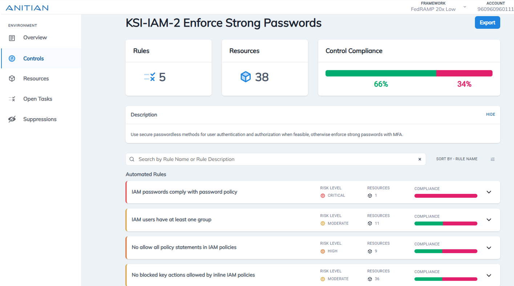

&nbsp;
&nbsp;
&nbsp;
&nbsp;

   

&nbsp;
&nbsp;
&nbsp;
&nbsp;   

Anitian is pleased to submit our final FedRAMP 20x Phase One pilot package. This submission builds on our previous draft submission and demonstrates our commitment to supporting the PMO’s vision of faster, more transparent, and more scalable FedRAMP authorizations. We look forward to working together to deliver innovative solutions for the U.S. government.  

## Anitian FedFlex

FedFlex is Anitian’s AI-powered, cloud-native compliance automation platform purpose-built for the FedRAMP 20x program. FedFlex combines pre-engineered security, agentic AI, and expert advisory support to accelerate and manage the full compliance lifecycle, from assessment through continuous monitoring, with rigor and efficiency.  

Key capabilities of FedFlex include: 

- Pre-configured, reusable platform aligned to 20x requirements 
- Automated and AI-supported evidence collection with machine-readable outputs 
- Pre-mapped KSIs tied to robust automated testing 
- 3PAO-attested compliance with A-LIGN 
- Seamless path to FedRAMP Moderate/High authorizations 
- Continuous monitoring enablement and reporting 

We believe this submission clearly demonstrates FedFlex’s readiness to help SaaS providers achieve faster, more consistent, and more secure compliance outcomes, fully aligned with the strategic objectives of the FedRAMP 20x initiative. 

  
## Submission Details 
Our final assessment is available to the FedRAMP PMO through our Insights platform. However, in the spirit of open collaboration and transparency, we include here a public version of our assessment file, the file schema, and the letter of attestation from our 3-PAO partner A-LIGN. 

| File | Description |
|----------|----------|
| [FedFlex Assessment File](Anitian_20x_Attestation_Official.json)    | Final Public Assessment Package  |
| [Anitian 20x Schema](Anitian_Evidence_Objects.json)    |  Data Schema for Machine Readable Assessment Package |
| [A-LIGN Attestation Letter](A-LIGN_Attestation_Letter-Anitian_FedRAMP_20x.pdf)    |  3PAO Partner A-LIGN's Attestation Letter|

## Anitian Validation Approach
To support the FedRAMP 20x pilot’s goals of increased automation, simplified auditability, and reduced assessment burden, Anitian developed the FedFlex platform to streamline the full compliance lifecycle from preparation and assessment to continuous monitoring and validation. Purpose-built for 20x, FedFlex leverages agentic AI to generate machine-readable evidence aligned to the Key Security Indicators (KSIs), enabling faster, more consistent authorization with reduced manual effort.  

Key elements of our validation approach include:
- **Alignment to KSIs:** FedFlex maps each KSI to a set of automated tests and supporting documentation to provide a clear and auditable compliance path. This eliminates ambiguity and ensures that every assertion is backed by verifiable, standardized evidence. 

- **Audit Acceleration via Auditor View:** To simplify validation, FedFlex includes an “Auditor View,” a dedicated 3PAO interface within the Anitian Insights dashboard that enables auditors to review KSI-aligned evidence and digitally sign off on each item. This helps reduce cycle times and subjectivity during package review. 

- **Machine-Readable Evidence Packages:** Our AI agents automatically collect evidence that it is correctly mapped, summarized, evaluated, and prepared in machine-readable formats for audit.

- **Continuous Monitoring Enablement:** Automated tests and manually uploaded evidence tied to each KSI remain accessible throughout the lifecycle. This enables continuous validation of security posture and positions customers for seamless transition to ongoing monitoring. 

- **Designed for Reusability and Scale:** The FedFlex evidence model and automation workflows are designed for repeatability across workloads and future FedRAMP baselines, minimizing redundancy as customers progress to Moderate or High authorizations. 

Taken together, these capabilities reflect Anitian’s deep experience in FedRAMP and demonstrate our readiness to support the pilot’s vision: faster compliance, better evidence, and scalable security assurance. 

## 3PAO Review 
   

## Continuous Reporting on KSIs 
Anitian will use our FedFlex product to provide continuous reporting on KSI validations. Designed specifically for the FedRAMP 20x Pilot, our FedFlex AI agent sifts through all uploaded documents and automatically:
- Maps that evidence to the correct control
- Extracts and summarizes the evidence provided
- Evaluates if evidence fully covers the control or if other evidence might still be required
- Produces all metadata required for auditor review

Additionally, it collects evidence for each KSI and runs automated pass/fail tests. For KSIs requiring manual evidence, documents are uploaded directly to the FedFlex dashboard for auditor review. While both our 3PAO partners and customers will review evidence within the platform, we can also generate a JSON file for external review if needed.

## Anitian FedFlex in Action

### Auditor View
Anitian Insights provides an auditor view specifically designed for the 20x KSIs. This allows assessors to review up-to-date evidence, leave comments, and request additional documentation as needed. Additionally, an API is available for auditors to download evidence and integrate it into their own systems.

### Automated Evidence Collection
Wherever possible, evidence is automatically collected, but for evidence that is not programmatically available, FedFlex allows customers to upload additional relevant evidence such as documents, policies, architecture diagrams, and more. Our AI assistants handle the rest: they analyze, process, evaluate, and map the uploaded content to the appropriate KSIs. Once complete, they provide an overview of which KSIs have been covered and identify any additional evidence that may still be needed. 

### Automated KSI Validation
We have 143 rules mapped to KSIs that can be automatically evaluated. We will continue to expand and enhance automation to support validation of additional KSIs going forward.

